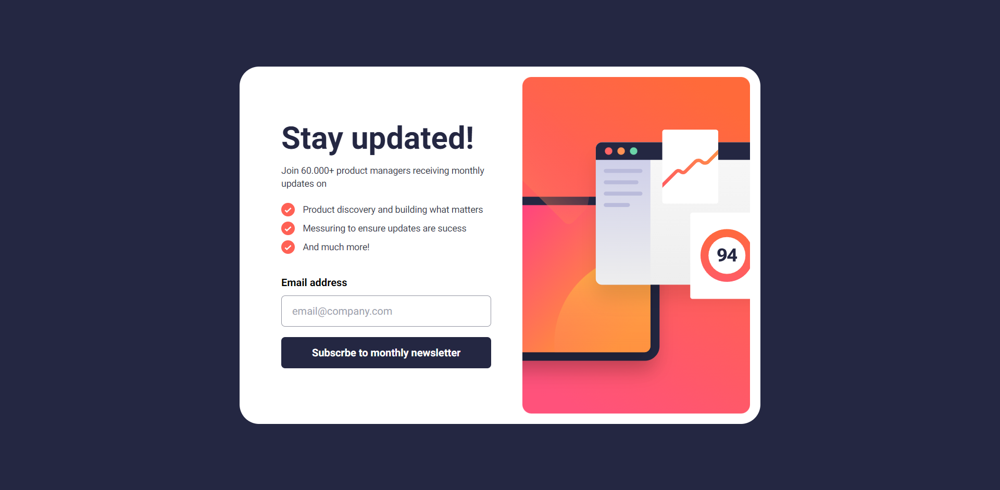
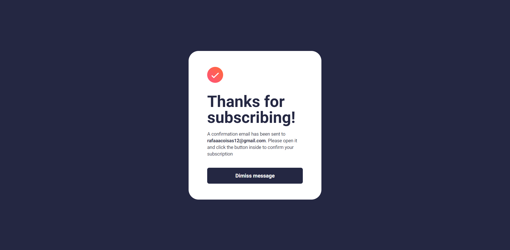
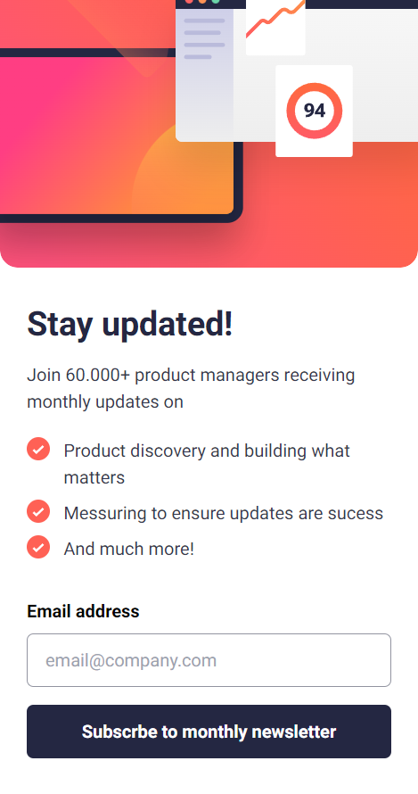
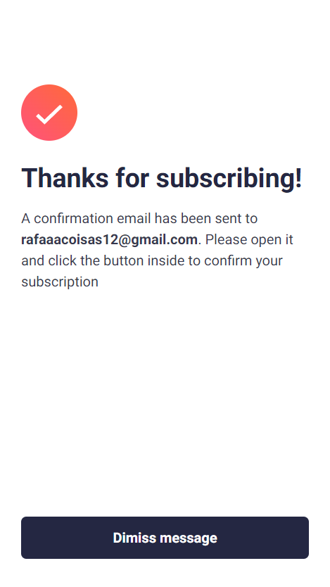

# Frontend Mentor - Newsletter sign-up form with success message solution

This is a solution to the [Newsletter sign-up form with success message challenge on Frontend Mentor](https://www.frontendmentor.io/challenges/newsletter-signup-form-with-success-message-3FC1AZbNrv). Frontend Mentor challenges help you improve your coding skills by building realistic projects.

## Table of contents

- [Overview](#overview)
  - [The challenge](#the-challenge)
  - [Screenshot](#screenshot)
  - [Links](#links)
- [My process](#my-process)
  - [Built with](#built-with)
  - [What I learned](#what-i-learned)
  - [Continued development](#continued-development)
- [Author](#author)

## Overview

### The challenge

Users should be able to:

- Add their email and submit the form
- See a success message with their email after successfully submitting the form
- See form validation messages if:
  - The field is left empty
  - The email address is not formatted correctly
- View the optimal layout for the interface depending on their device's screen size
- See hover and focus states for all interactive elements on the page

### Screenshot

### Links

- Solution URL: [https://github.com/Raza6869/Newslatter-form](https://github.com/Raza6869/Newslatter-form)
- Live Site URL: [https://newslatter-form.vercel.app/](https://newslatter-form.vercel.app/)

## My process

### Built with

- Semantic HTML5 markup
- CSS custom properties
- Flexbox
- Mobile-first workflow
- [React](https://reactjs.org/) - JS library
- [Next.js](https://nextjs.org/) - React framework
- [Tailwind.css](https://tailwindcss.com/) - CSS framework
- [Typescript](https://www.typescriptlang.org/) - JavaScript with syntax for types.

### What I learned

In this litte project, I started my studies with Typescript. Honestly, I liked so much, bringing more organization to my code is really impressive. On the other hand, I praticed more with the react context toll, which I used frequently in my latest projects.

Another thing I learned it's the image change when the screen is resized to bring responsiveness to the project interface.

### Continued development

After this project, which I made just for pratice and return to my studies, I wanna do some like a full-stack project to learn more about the back-end. After all, my objective in this carrer it's be a Fulltack Engeneer.

But, the focus right now, it's typescript and MongoDB.

## Author

- Frontend Mentor - [@Raza6869](https://www.frontendmentor.io/profile/@Raza6869)
- Linkedin - [Rafael Thumaza](https://www.linkedin.com/in/rafael-thumaza-744b17250/)
